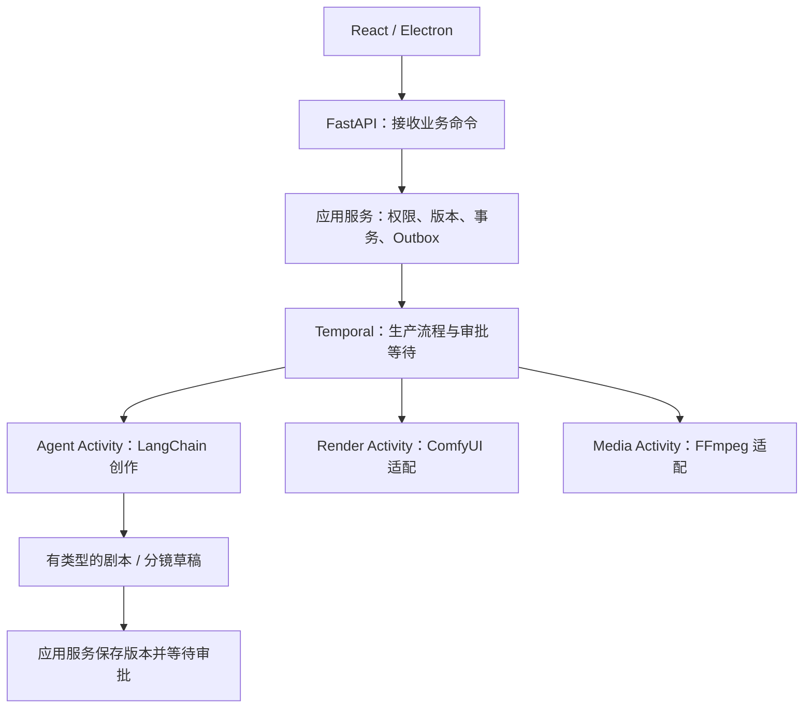

# 当前架构评估与下一阶段边界

评估日期：2026-09-07。依据为本仓库实际代码和下列官方文档。结论：技术方向适合这个视频项目，第一阶段结构可以继续演进；当前实现尚不能称为经过生产验证的 Agent 系统，也没有证据把某一种目录结构称为行业“最主流、最工业级”的唯一答案。

## 当前结构的评价

| 项目 | 当前事实 | 判断 |
|---|---|---|
| 前后端同仓 | frontend / backend / contracts / deploy 分开 | 保留；开发协作和合同同步比较直接 |
| Python 包布局 | backend/src/video_generation + pyproject.toml + uv.lock | 保留；是标准 src 布局，需要安装项目并选择对应解释器 |
| API 与执行服务 | FastAPI 不直接持有 GPU 推理环境，桌面独立运行 | 保留；便于未来独立部署 Worker |
| 数据可靠性 | PostgreSQL、迁移、幂等、版本冲突、持久化事件 | 是工程底座的有效部分，尚不覆盖整个视频链路 |
| domain | projects.py / auth.py 同时处理用例、事务与 ORM | 应调整；当前更接近应用服务层，不能宣称严格的领域隔离 |
| adapters/ports.py | 只有 Protocol，AgentProvider 返回 dict | 只是扩展占位；应拆出带类型、上下文和错误语义的内部接口 |
| Agent 与编排 | 没有安装或实现 LangChain / Temporal Worker | 尚无法评价真实 Agent 的质量、费用和恢复效果 |
| React | App.tsx 汇集项目、配对、详情、设置等页面 | 本阶段能运行；新增编辑器前应按业务拆分组件和请求逻辑 |
| 发布运行 | 单机回环地址、目录构建、本地验证 | 不是公网多用户产品，也没有完整 CI/CD、备份恢复或容量验收 |

PyPA 文档说明 src 布局把可导入包与仓库工具文件分开，开发时通常需要 editable install。这种布局本身不会因为 PyCharm 打开 backend 就失效。[Python Packaging 文档](https://packaging.python.org/en/latest/discussions/src-layout-vs-flat-layout/)

## 建议的 Agent 组织方式

项目的主要步骤可以明确为：需求确认 → 剧本 → 分镜 → 用户审批 → 镜头生成 → 合成 → 导出。因此建议以业务流程为主线，在需要推理和动态工具调用的步骤内部使用 Agent。



这是**下一阶段的目标结构**，图中的 Temporal、Agent、Render 和 Media Activity 还未实现。

LangChain 当前的 `create_agent` 使用 LangGraph 作为内部运行时；已有 agent 循环不必再手工包一套相同循环。LangGraph 官方也区分了预先定义步骤的 workflow 与自主选择步骤的 agent。对单次有明确输入输出的剧本草稿，可先用结构化模型调用；需要查素材、修正草稿等动态工具使用时，再使用受限的 agent 循环。[LangChain Agents](https://docs.langchain.com/oss/python/langchain/agents)、[Workflows and agents](https://docs.langchain.com/oss/python/langgraph/workflows-agents)

职责约束：

- **Temporal** 是整个视频生产流程的唯一推进者，负责阶段、审批等待、取消与重试。项目/内容版本仍由业务数据库保存。
- **LangChain / 内部 LangGraph** 负责一个有边界的创作步骤，不再拥有另一套独立推进相同项目阶段的状态机。
- **Agent 工具** 通过应用服务执行受控动作，不绕过权限、审批和预算直接修改生产表或提交任意 GPU 工作流。
- **ComfyUI / FFmpeg 调用** 位于 Activity / Worker 适配层，保留原操作 ID、输入版本、任务回执、错误分类和产物引用。

LangChain 支持基于 Pydantic 的结构化输出；生产输入和输出应约束为 `ScriptDraft`、`StoryboardDraft` 等合同，避免长期使用无约束 dict。[Structured output](https://docs.langchain.com/oss/python/langchain/structured-output)

模型调用和外部 I/O 应位于 Temporal Activity，业务 workflow 负责可靠协调。一次外部请求可能已经发生、但结果尚未成功记录，所以仍要为副作用设计幂等与查询机制；选用持久化框架本身不等于保证外部调用只执行一次。[Temporal Python Activities](https://docs.temporal.io/develop/python/activities)

Temporal 的额外服务和运维成本值得明确：目前项目管理不需要启动它；当开始接入跨进程审批、长时间 GPU 任务和恢复时再引入。如果最终只做很短的个人试验流程，也可以重新评估单独使用 LangGraph 持久化是否更简单。依据当前完整产品需求，保留 Temporal 外层编排是合理选择。

## 下一次结构调整建议

保留模块化单体，不马上拆成多个微服务仓库。随着真实生成步骤加入，演进到下列结构；此处不是要求立即创建全部空目录：

```text
video_generation/
  api/                 HTTP 路由、认证适配、错误转换
  application/         项目/创作用例、事务协调、内部 ports
  domain/              业务规则、状态转换、值对象
  contracts/           HTTP、Agent、Worker 的版本化消息合同
  infrastructure/
    persistence/       SQLAlchemy、repository、工作单元
    agents/            LangChain 实现、模型配置、提示词版本
    render/            ComfyUI 工作流映射、回执、结果采集
    media/             FFmpeg / ffprobe
    storage/           本地或对象存储实现
  orchestration/       Temporal workflows / activities
  workers/             各类 Worker 的进程入口
  bootstrap.py         依赖组装与生命周期
  cli.py               命令入口
  __main__.py          python -m video_generation
```

内部业务规则不依赖 FastAPI、SQLAlchemy、LangChain 或 ComfyUI；基础设施实现应用层定义的接口，入口负责组装。仓库层方法按业务需要定义，避免为每个表机械生成通用 CRUD 抽象。

优先改动顺序：

1. 将当前 domain 中的事务用例迁入 application，提取业务规则和必要的 repository / transaction 接口，保持现有 API 和数据库事务行为不变。
2. 在真实创作步骤落地前定义 AgentRunContext、ScriptDraft、StoryboardDraft 与可恢复错误类型；上下文至少含 tenant、actor、operation_id、输入内容版本、deadline、预算和模型/提示词版本。
3. 添加独立 Agent 实现、版本化提示词、测试数据集和必要工具；把模型步骤与审核步骤分开。
4. 随第一条真实视频流程一起引入 Outbox、Temporal、执行回执和 Worker；用故障测试验证恢复。
5. 前端拆出 projects / pairing / settings 等业务模块，为后续剧本、分镜编辑器留出清楚的组件边界。

## 达到生产可用还需要的证据

工业化程度要由运行行为验证：真实输出的有效率和内容质量、延迟与费用预算、取消和重试、断电/超时/未知结果恢复、多租户与工具权限、模型/提示词/工作流可追溯、监控与回归评测、CI/CD、数据库备份与恢复演练。

当前项目有其中的部分工程底座和自动测试，没有上述完整运行证据。下一步应围绕一条可验收的视频生成链路补齐这些能力，再根据实际数据决定是否增加独立服务或更复杂的 Agent 结构。
