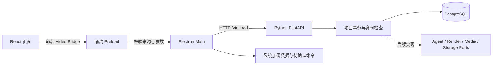

# 第一阶段：工程底座与项目管理

用户批准的实现范围为 Python 后端、真实 PostgreSQL、Electron 桌面外壳和 React 项目管理工作台。第一阶段的“完成”指本文件中的业务闭环，不代表 G00–G17 的全部要求或 B0–B4 已完成。

后续代码结构与 Agent 边界的具体评估见 [架构评估](architecture-review.md)。

## 已实现的闭环

1. 管理命令初始化本机工作空间与 owner，签发一次性配对码。
2. 桌面配对后读取当前身份，展示真实项目列表、加载/空白/离线状态。
3. 创建项目；查看详情和最近事件；重命名、归档、恢复；按创建时间分页。
4. 每次写操作保存原 `command_id`，服务端去重。相同 ID 不同内容返回 409。
5. 修改携带 `expected_row_version`。冲突时保留输入，并显示最新名称，由用户选择后继续保存。
6. 断线或服务端 5xx 后保留待确认命令；重启桌面先查执行结果，404 时使用原 ID 和原载荷重新提交。
7. 关闭桌面不影响 API；重启 API 后，项目、命令结果和设备身份可继续读取。

## 进程与调用边界

Renderer 启用 sandbox、contextIsolation，关闭 Node 集成；无任意 HTTP、文件系统或通用 IPC 能力。生产页面由 `app://video` 加载，拒绝外部导航、弹窗与权限请求，CSP 阻止页面直接访问 API。开发 HMR 仅接受 `http://127.0.0.1:5173`。

Main 使用生成的 TypeScript DTO 与 `openapi-fetch`；IPC 请求通过 Pydantic 导出的 JSON Schema 和 Ajv 校验，查询参数也有严格白名单。系统 `safeStorage` 加密 session token 与待确认请求，文件原子替换；不把 token 交给 React。修改、恢复和配对串行处理。过期会话可使用原身份重新配对后继续恢复。

API 仅绑定回环地址。身份取自服务端会话与 active membership，不接受请求体提供的 tenant / actor。项目读取按 tenant 隔离，修改限 owner/editor；系统 actor 不能使用桌面会话。命令结果按 tenant + actor + command_id 隔离。一次性配对码和 session token 在数据库中只保存摘要。

## 数据与恢复

表：`workspaces`、`actors`、`memberships`、`pairings`、`device_sessions`、`projects`、`commands`、`project_events`。关联使用复合租户外键，数据库唯一约束确保命令去重及项目内事件序号不重复。Alembic 迁移头为 `0001_foundation`。

写事务同时提交项目、命令结果与事件。并发相同命令通过 PostgreSQL `ON CONFLICT` 等待首个事务，后续返回持久化结果；版本冲突等领域拒绝也保存为 `REJECTED`。数据库异常回滚，客户端保留原请求继续查询。

项目快照和 `event_cursor` 来自同一行查询。事件按项目连续递增；后台轮询以观察到的游标为上界，检测过期/超前/缺口后要求重新读取快照。详情页前台约 1 秒、后台约 5 秒轮询，错误指数退避至 30 秒。当前事件不做清理或压缩。

此阶段采用同一时间只确认一条桌面写命令的交互。待确认期间阻止新的写入和解除配对，避免把未知结果当作失败后重复创建。

## 与原开发文档的关系

| 目标 | 本次实现的子集 | 仍需后续实现 |
|---|---|---|
| G01 / G16 | 独立进程、配置、锁文件、运行脚本、健康检查 | Worker、完整部署与可观测性 |
| G02 | 项目元数据、租户身份、关系约束、合同生成 | 内容版本、素材、任务、预算、依赖图 |
| G03 | 项目写命令、幂等、版本比较、事件与恢复查询 | 审批、事务 Outbox 和跨服务投递 |
| G14 | 独立 Electron / React 外壳、配对和项目页面 | 编辑器、审片、播放器、受控媒体协议 |
| G17 | 本阶段数据库、合同、桌面与恢复测试 | 视频制作全链路和 GPU 故障验收 |

原有 107 个功能 ID 和 111 个目标验收 ID 保留，未将完整目标标记为验收通过。

## 后续实现顺序

1. 内容版本、需求/剧本/分镜合同、审批与事务 Outbox。
2. Temporal Python workflow 与独立 Worker，负责长流程等待、取消和恢复。
3. LangChain Python `AgentProvider`，输出符合 Pydantic 合同的创作草稿。
4. `RenderPort` 的 ComfyUI 适配器：提交 API-format 工作流到 `/prompt`，监听 `/ws`，使用 `/history/{prompt_id}` 回查，收集实际视频输出。后端处理工作流节点映射、未知结果和产物归档。
5. Media / Storage 实现，接配音、FFmpeg 合成、成片规格校验与导出。

React 不直接访问 ComfyUI；ComfyUI 作为独立 GPU 推理服务。详细协议与提交超时规则见 [ComfyUI 对接方案](../技术选型与ComfyUI对接方案.md)。本阶段 Protocol 与测试 Fake 不产生视频，能力接口明确返回 `not_integrated`。
