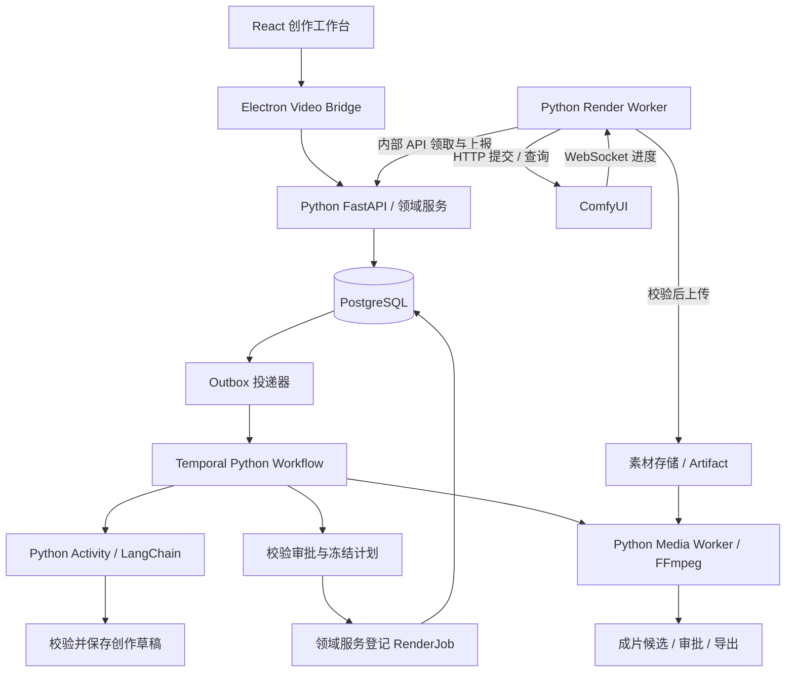

# 技术选型与 ComfyUI 对接方案

日期：2026-09-07。依据：已逐份阅读本仓库开发文档 README 与 G00–G17，并核对下文链接的官方技术资料。

状态：用户已批准并实施第一阶段 Python 后端、PostgreSQL 与 Electron / React 桌面工程，依赖已锁定。实际范围见 [第一阶段实现](docs/phase-one.md)。本文仍描述完整目标架构；LangChain、Temporal、ComfyUI 与 FFmpeg 的真实链路尚未接入，不代表 B0–B4 已完成。

## 1. 推荐方案

采用 **React + TypeScript 前端、Python / FastAPI 业务后端、LangChain Python 创作适配器、Temporal Python SDK 长流程编排、PostgreSQL 业务存储，以及独立 Python Render Worker 通过 HTTP / WebSocket 调用 ComfyUI**。视频合成由 Python Media Worker 调用 FFmpeg。

保留 G00 的首版范围：中文解说、30–60 秒、3–8 个镜头；默认竖屏 720×1280、24 fps，交付 MP4、SRT、剧本、分镜和来源清单。先接一套通过验证的图生视频工作流。

| 层 | 建议选择 | 在本项目中的职责 |
|---|---|---|
| 工作台 | React + TypeScript + Vite | 剧本/分镜编辑、任务展示、候选审片、时间线及视频播放 |
| 桌面外壳 | Electron，按 G14 的桌面交付范围实施 | 文件选择、设备会话、Video Bridge、受控媒体读取；开发阶段先使用验收页面 |
| 前端数据 | TanStack Query + Zustand | Query 缓存服务端快照；Zustand 管面板、播放位置等 UI 状态；未保存草稿单独管理 |
| 业务 API | Python + FastAPI + Uvicorn | 身份、项目、版本、审批、命令、预算、素材和状态查询 |
| Agent | LangChain Python | 需求整理、剧本、分镜、修改建议及结构化输出，封装成 LangChainAgentProvider |
| 持久化编排 | Temporal + Python SDK（temporalio） | 阶段推进、等待审批、暂停/恢复、错误分流和跨进程恢复 |
| 业务数据库 | PostgreSQL 17 + SQLAlchemy 2 + psycopg 3 + Alembic | 不可变版本、任务/尝试、Outbox、预算账本、依赖边及版本化数据库迁移 |
| 数据合同 | Pydantic v2 → JSON Schema 2020-12 / OpenAPI → TypeScript 客户端 | 统一 DTO、Agent 输出和 Worker 协议；Python 模型为编写入口，版本化 JSON 合同供跨进程使用 |
| 渲染适配 | Python Render Worker + httpx + websockets + SQLite journal | 领取任务、持久化回执、ComfyUI 调用、回查和文件收集 |
| 视频推理 | ComfyUI 独立 Python / PyTorch 环境 | 执行锁定的工作流、模型和自定义节点 |
| 媒体后期 | 独立 Python Media Worker + FFmpeg / ffprobe | 音视频探测、静态分镜预览、规格统一、字幕、混音与导出 |
| 文件存储 | StoragePort；开发本地文件，部署 S3 兼容存储 | 保存参考图、配音、原始镜头、选片和成片；数据库保存引用与摘要 |
| 工程与验证 | 后端 uv、pytest、Ruff；前端 pnpm、Vitest、Playwright；Temporal Python 测试工具 | Python 依赖锁、静态检查、模块合同、数据库并发、恢复故障与完整用户旅程验证 |
| 部署与观测 | Compose 管理基础服务，GPU 端可原生运行；结构化日志、关联 ID | 服务独立于界面运行，固定依赖、持久卷及恢复流程 |

React 官方提供 Vite 起步方案；TanStack Query 用于异步服务端状态。这里选择这组工具服务于编辑与审片工作台。[React 文档](https://react.dev/learn/build-a-react-app-from-scratch)、[TanStack Query 文档](https://tanstack.com/query/latest/docs/framework/react/overview)

业务 Python 暂以 3.12 为兼容性验证起点，B0 根据依赖支持与运行验证锁定具体版本。uv 使用 `pyproject.toml`、`uv.lock` 和独立虚拟环境管理后端；Node / pnpm 只服务于前端与 Electron 构建，其版本另行验证。ComfyUI 使用独立的 Python / PyTorch / CUDA 环境和依赖锁，不要求与业务后端版本相同。[uv 项目结构](https://docs.astral.sh/uv/concepts/projects/layout/)

FastAPI 提供基于 Python 类型的数据验证和 OpenAPI 支持，适合这里的业务 API；SQLAlchemy 管理数据库访问，Alembic 管理经审查的迁移。每个请求/并发任务拥有自己的 AsyncSession，事务不能跨模型或 GPU 网络调用长时间保持。[FastAPI 功能](https://fastapi.tiangolo.com/features/)、[SQLAlchemy 异步访问](https://docs.sqlalchemy.org/en/20/orm/extensions/asyncio.html)、[Alembic 文档](https://alembic.sqlalchemy.org/en/latest/)

首版采用一个模块化业务后端和数个独立 Worker 进程。GPU 待办使用 PostgreSQL 任务表，领取采用短事务和行锁；`SKIP LOCKED` 可用于队列式领取，但不能替代预算、能力和租约校验。[PostgreSQL SELECT 文档](https://www.postgresql.org/docs/17/sql-select.html)

## 2. 与原开发文档的衔接

本仓库只有视频开发文档，没有原稿引用的 DSH/Harness 工程、`UI开发/`、`开发文档/`、`upstream.lock.json` 或 Node 工程配置。因此“延续现有桌面”的工程前提尚不成立。

| 原目标 | 本次处理建议 |
|---|---|
| G01、G05 的 AgentProvider / DSH | Python 实现 LangChainAgentProvider；DSH 留作可选适配，不作为启动依赖 |
| G04 的唯一全局编排器 | 保留 Temporal；LangChain 只在某个创作 Activity 内执行 |
| G14 的 Electron + React | 保留桌面交付范围，后续新建独立外壳或接入实际提供的桌面工程；不假定已有 Bridge |
| G02 的业务真源 | 保留 PostgreSQL 和不可变版本；明确 Pydantic 模型生成发布合同，Agent 的消息历史不能代替项目数据 |
| G08、G10 的渲染边界 | 保留 Bundle、RenderSpec、Worker journal 与未知结果处理 |
| G17 的实现阶段 | 按 B0–B4 推进，开发验收页面不等于完成桌面工作台 |

若后续确定只交付浏览器应用，应同步调整 G01/G14/G15：浏览器经认证的 Video API 和媒体接口访问后台，设备配对/Bridge/CSP 合同随交付形态重写。本次不隐式取消桌面要求。

## 3. LangChain 怎么放进系统

使用 LangChain Python，业务 API、创作适配器、Workflow Worker、Render Worker 和 Media Worker 都用 Python 实现。图像处理、语音对齐、模型推理等 Python 工具可封装为受控领域能力；新增库时记录依赖、输入输出和资源限制。前端继续使用 React / TypeScript，通过生成的 API 客户端对接 Python。

Python 是业务代码的语言，不要求把所有模型装进同一个环境。重型工具放在对应执行进程；ComfyUI 保持独立环境并通过网络协议调用，不在 FastAPI 或 LangChain 进程中直接导入 ComfyUI 内部模块。

将首版创作拆成有界任务：

1. Brief：用户描述 → 需求草稿与缺失字段。
2. Script：已确认需求 → 旁白段落、画面说明、屏幕文字。
3. Storyboard：剧本、实际配音时长、参考素材 → 分镜与 ShotSpec 草稿。
4. ProposedChange：已有版本和反馈 → 字段修改建议。

仅需结构化生成时使用 LangChain 模型接口；确需查询素材等工具时使用 Python 的 `create_agent`，配置 `response_format`，优先传入 Pydantic 模型并读取 `structured_response`。工具可封装 Python 函数，但仍须遵守 G05 的授权与预算边界。结果再次通过完整业务校验后由领域服务保存。[LangChain Python 结构化输出](https://docs.langchain.com/oss/python/langchain/structured-output)

LangChain 的 Agent 底层使用 LangGraph。这与 G04 并不冲突：允许其处理单个创作任务内部的模型/工具步骤；项目审批、GPU 派发、取消和成片推进仍由 Temporal 与领域服务负责，不另建第二套项目状态机。[LangChain Python 官方概览](https://docs.langchain.com/oss/python/langchain/overview)

建议边界：异步 `AgentProvider.generate(spec, operation_id)` / `query(operation_id)`。LangChain、供应商 SDK 和模型请求都在 Python Activity 内，Temporal Workflow 不直接调用网络。Activity 的重试不会自动让外部副作用变成只发生一次。[Temporal Python SDK](https://docs.temporal.io/develop/python)、[Temporal Activity 定义](https://docs.temporal.io/activity-definition)

落实 G05 每任务最多 3 次模型调用时，必须把 LangChain 内部格式修复、供应商 SDK 重试和工具循环一并纳入计数与预算。持久化每次 operation_id 及结果引用；调用结果未知时进入回查/待处理，不能让多层重试重复扣费。

Pydantic v2 模型是结构合同的唯一编写入口，生成并版本化 JSON Schema 2020-12 与 OpenAPI，再生成前端 TypeScript 类型/客户端。配置严格字段校验与未知字段拒绝；请求、响应与序列化模式分别验证。跨对象授权、预算和时间线等业务规则仍由领域服务校验，不能假设它们都能表达成 JSON Schema。面向模型供应商的 Schema 子集由适配器转换，返回结果按完整业务模型校验。[Pydantic JSON Schema](https://docs.pydantic.dev/latest/concepts/json_schema/)

B0 用共同有效/无效样例验证 Python 校验器、发布的 JSON Schema、前端运行时校验和 Temporal JSON 序列化一致，禁止手工维护一份会漂移的 TypeScript 业务模型。FastAPI 的进程内后台任务不承担视频生产恢复；长任务交给 Temporal 和独立 Worker。同步的文件/数据库操作须使用合适的线程或独立进程执行，不能阻塞 asyncio 事件循环。

## 4. ComfyUI 的交互结构



对 ComfyUI 的核心调用由 Python Render Worker 封装：使用 `httpx.AsyncClient` 提交/查询/上传，使用 `websockets` 订阅进度。复用有界连接池，大文件使用流式传输，提交操作禁用自动重试。[HTTPX 异步客户端](https://www.python-httpx.org/async/)、[websockets 文档](https://websockets.readthedocs.io/en/stable/intro/tutorial1.html)

前端提交“生成镜头”领域命令；Agent 生成镜头描述；编译器把描述映射到经过测试的工作流；Worker 执行和收集。关闭界面、Agent 调用结束或某个进程重启后，系统按持久化业务记录恢复。

以下针对自托管 ComfyUI Server API。云端 Comfy 服务的认证和任务接口需使用对应适配器，不能直接混用。

### 4.1 先固定一套工作流

在 ComfyUI 中跑通一套图生视频流程，导出 **API Format JSON**。当前官方文档给出的入口是 `File → Export Workflow (API)`；旧版本界面可能不同。普通界面保存文件包含布局信息，不能直接当作执行图提交。[Workflow API Format](https://docs.comfy.org/development/api-development/workflow-api-format)

把它登记为 G08 的 WorkflowBundle，至少包括：

- API 执行图、图的摘要、允许修改的公开参数及参数绑定。
- 模型/LoRA/VAE 文件摘要、自定义节点提交、Python/PyTorch 依赖及运行环境。
- 支持的原生尺寸、帧数规则、fps、输入参考条件与时长范围。
- 输出节点清单、输出解析器、受控文件命名前缀、实测耗时与显存基线。

`positive_prompt`、`input_image`、`seed` 等业务参数通过 bindings 映射到固定节点的 `inputs`。节点编号只在包内部出现。增加节点、换模型或改绑定要发布新 Bundle；一次执行从冻结副本编译，不能修改共享模板。

### 4.2 实际会调用哪些接口

| 接口 | Worker 中的用途 |
|---|---|
| `GET /system_stats` | 查看实例设备/运行信息，配合本地环境检查 |
| `GET /object_info` | 获取节点定义，校验模板需要的节点与输入 |
| `POST /upload/image` | multipart 上传已验证参考图，保存返回的文件标识 |
| `POST /prompt` | 提交已编译的 API 执行图，记录返回的 prompt_id |
| `WS /ws?clientId=...` | 接收执行进度；对应提交体使用 client_id |
| `GET /queue` | 回查正在运行和等待中的任务 |
| `GET /history/{prompt_id}` | 获取对应执行记录及输出描述 |
| `GET /view?filename=...&subfolder=...&type=output` | 在锁定版本/节点支持时读取已保存输出；视频读取需实测 |
| `POST /queue`，`{"delete":["<prompt_id>"]}` | 删除已确认身份的待运行任务 |
| `POST /interrupt` | 根据锁定版本能力中止目标执行，并回查停止事实 |

路由和基本用途依据官方 Server API；参数与响应以所用版本的合同测试为准。[ComfyUI 路由说明](https://docs.comfy.org/development/comfyui-server/comms_routes)

### 4.3 一次镜头生成的执行顺序

1. 用户在 React 中确认输入和预算。Video API 保存命令、冻结快照、Run 和 Outbox，返回 202 与业务任务 ID。
2. Temporal 推进制作，领域服务建立 RenderJob。Render Worker 领取带 attempt_id 和 fence 的任务；Alpha 每个 ComfyUI 实例只保留一个活跃任务。
3. Worker 预检 Bundle、模型、输入和磁盘。素材从存储下载，必要时经 `/upload/image` 放入 ComfyUI 输入目录，记录实际返回标识；不传用户机器绝对路径。
4. 打开 WebSocket，按参数绑定编译工作流，设置本次唯一输出前缀。先持久化 PREPARED、SUBMITTING，再发送一次 `/prompt`。
5. 收到回执，先将 prompt_id 与实例 ID/epoch、attempt_id 一起落盘，再上报 ACCEPTED。WebSocket 用于界面进度；断线时通过队列/历史补查。
6. 获得完成线索后，检查执行状态与 Bundle 指定的输出节点，读取文件、计算摘要、完整解码并探测媒体规格。
7. 文件进入素材存储且登记 READY Artifact 后，业务任务才能成功。视频已生成但上传失败，只补传文件。
8. 用户审片、选定镜头后，Media Worker 按冻结时间线合成配音、音乐与字幕，成片审批通过后登记导出。

官方示例展示了 WebSocket 配合历史查询的模式，底层协议与调用语言无关。本项目增加持久化日志、预算和业务状态登记以满足 G03/G09/G10。[ComfyUI API 示例](https://docs.comfy.org/development/comfyui-server/api-examples)

### 4.4 请求长什么样

下面只展示 Python 提交片段。调用方提供绑定到受控 ComfyUI 地址的 AsyncClient、来自 RuntimeProfile 的超时配置和预检通过的执行图，并在调用前将 journal 的 SUBMITTING 持久化。这不是本次已实现的生产客户端。

```python
from typing import Any

import httpx


async def post_prompt_once(
    client: httpx.AsyncClient,
    compiled_api_graph: dict[str, Any],
    websocket_client_id: str,
    attempt_id: str,
    render_spec_digest: str,
    submit_timeout: httpx.Timeout,
) -> httpx.Response:
    request_body = {
        "prompt": compiled_api_graph,
        "client_id": websocket_client_id,
        "extra_data": {
            "video_generation": {
                "attempt_id": attempt_id,
                "render_spec_digest": render_spec_digest,
            },
        },
    }
    # client 的传输层及本函数调用方均不得自动重试这次提交。
    return await client.post("/prompt", json=request_body, timeout=submit_timeout)

# 调用方校验 HTTP 状态与响应 Schema，先持久化回执，再上报 ACCEPTED。
# 超时、取消或响应丢失进入回查，不能直接再次调用 post_prompt_once。
```

`extra_data.video_generation` 是本项目拟使用的关联标记，不是 ComfyUI 自带的去重功能。它在 queue/history 中的保留和回读必须通过实际版本测试；无法回读时不能依赖它判定是否执行。

截至核对日期，上游 `server.py` 支持客户端传入 UUID 格式的 prompt_id，也包含带 prompt_id 的中止处理及按 job ID 取消的接口。这些能力不能推定已安装旧版本具备。提交路径中未见“相同 prompt_id 必定只入队一次”的保证，因此仍保留本地去重与未知结果状态。该结论来自源码检查，尚未在本机做运行验证。[ComfyUI 服务端源码](https://github.com/Comfy-Org/ComfyUI/blob/master/server.py)

### 4.5 视频收集、进度与取消的边界

视频产物按 Bundle 指定输出节点解析。官方图片示例遍历 `outputs[node].images`，不能把它作为通用视频合同。原生视频保存节点与第三方节点可能使用不同 UI 输出结构；先为选定节点编写解析器，拒绝未知结构。Worker 与 ComfyUI 同机时，可从经校验的本次输出目录读取；分机时采用已测试的文件接口。前端播放归档素材，不直接访问 ComfyUI 临时输出。[ComfyUI 原生视频节点源码](https://github.com/Comfy-Org/ComfyUI/blob/master/comfy_extras/nodes_video.py)

WebSocket 的 `executed` 表示节点返回 UI 信息，不能当作所有节点的完成通知。`execution_success` 或 `executing` 的结束消息也只是收集线索；业务成功还需要有效文件和 READY 登记。采样步数只表示当前节点进度，不能直接声称整片完成百分比。[ComfyUI 消息说明](https://docs.comfy.org/development/comfyui-server/comms_messages)

首版实例由 Worker 独占，生产期间不接受其他用户手工排队。取消前校验实例世代和当前 attempt；有经测试的定向取消能力就使用它，否则仅在确认独占的实例上中止。无法确认身份或节点失联时保留 CANCEL_REQUESTED。取消接口返回成功不等于 GPU 已经停止。

### 4.6 断线后为什么不能直接重发

最危险的窗口是：ComfyUI 已受理并开始计算，Worker 尚未保存 prompt_id 就崩溃。普通网络重试会造成重复生成和潜在重复支出。

| 证据 | 恢复动作 |
|---|---|
| 可确认请求未发送 | 允许按 G09 策略重新尝试 |
| 已保存 prompt_id | 查原实例的队列、历史和输出 |
| 无回执，但找到经过验证的关联标记与匹配输出 | 补记回执并收集原结果 |
| 查不到，且历史已清空/实例换代 | 保持 OUTCOME_UNKNOWN，停止自动重提 |
| 已生成，上传/登记失败 | 仅重试收集和登记 |
| 用户明确要求再生成候选 | 新建 candidate_id/job_id，保留原记录并重新预算准入 |

SQLite journal 使用持久目录；中央数据库记录业务事实。Worker 重启先对账再接单。fence 只能阻止旧 Worker 改写结果，不能阻止失联 GPU 继续计算，保持 G09/G10 原有语义。

## 5. 前端如何获取进度和视频

React 通过 Video Client 调用领域命令，写操作携带 command_id，服务端返回可查询结果。项目显示来自一致的 Snapshot 与 event_cursor；按 G03 首版前台约 1 秒、后台约 5 秒按游标拉取，断线退避。以后需要更低延迟可增加推送，保留同样的补查合同。

ComfyUI 的 WebSocket 由 Render Worker 消费，再转成产品能理解的阶段：“排队”“生成”“上传”“待审片”“提交结果待确认”。审批、取消和任务成功都以服务端确认结果为准。

桌面最终播放器经 Main/Bridge 的受控媒体句柄读取 Range 字节流；浏览器验收页面使用受认证的开发媒体接口。原始视频、预览和最终成片分别登记，原件不能被晚到候选覆盖。

## 6. 第一套模型和配音怎么选

本次确定平台对接方式，尚缺 GPU 型号/显存、已有 ComfyUI 工作流、目标画面样例及模型/配音服务配置，不能据此锁定某个视频模型或保证生成速度。

首套采用已有可跑通的图生视频模板最便于验证：上传或选定镜头参考图，生成单镜头，再合成多镜头。若已有工作流可复用，就先验证其能力；若没有，按实际硬件和样例效果评估候选。模型原生尺寸/帧率与最终 720×1280/24 fps 分开，任何裁切或时长调整都进入可审查计划。

配音采用 TTSProvider 接口，同时支持用户上传音频。优先使用实际供应商时间戳；无时间戳时接入经过中文样例验证的强制对齐工具，并保留人工校正。按实际音频长度排分镜，后期复用选定旁白。字幕与混音由 FFmpeg 固定模板执行，字体与编译能力一起锁定。[FFmpeg 滤镜文档](https://ffmpeg.org/ffmpeg-filters.html)

## 7. 建议工程目录与开发顺序

以下是拟创建目录，本次没有创建空应用或宣称功能已实现：

```text
frontend/                         React / TypeScript / Electron，pnpm 工程
frontend/src/api/                  从合同生成的客户端及 Video Bridge 适配
backend/pyproject.toml             Python 工程、依赖与各进程入口
backend/uv.lock                    业务 Python 依赖锁
backend/src/video_generation/
  api/                            FastAPI、Outbox、内部 Worker API
  contracts/                      Pydantic 模型、错误和事件
  domain/                         命令、审批、预算、版本、任务与依赖
  storage/                        SQLAlchemy 仓储与 StoragePort
  agents/                         LangChainAgentProvider 与 FakeProvider
  orchestration/                  Temporal Python Workflows / Activities
  render/                         httpx / websockets、SQLite journal、回查
  media/                          TTS/对齐适配、FFmpeg、媒体任务日志
backend/migrations/               经审查的 Alembic 数据库迁移
backend/tests/                    pytest 合同、集成与故障测试
contracts/                        发布的 JSON Schema / OpenAPI 及共同样例
workflows/                        版本化 ComfyUI API 图、bindings、Bundle 清单
deploy/video/                     Compose、环境锁与恢复脚本
```

| 阶段 | 优先做什么 | 实际证明什么 |
|---|---|---|
| B0 | 工作区、合同、认证、数据库迁移、独立服务、依赖锁 | 各进程能启动，所有权与接口明确 |
| B1 | 项目命令、版本审批、Temporal、Outbox、FakeComfy、journal | 重复命令、重启、失联与预算竞争不会破坏业务记录 |
| B2 | LangChain、真实配音、分镜预览、一套 i2v Bundle 与真实 Worker | 参考图到镜头文件可追溯，断线可回查，上传失败不重生成 |
| B3 | Electron/React 完整工作台、审片、选片、局部重做与合成 | 30 秒 6 镜头成片可下载；改字幕只重新合成 |
| B4 | 两租户/两实例、取消竞态、升级、备份恢复、容量 | 达到文档约定的对外发布门槛，有实际证据 |

ComfyUI 联调的最小验收包含：一次有效提交、一次坏参数拒绝、受理后断连、WebSocket 重连、历史清空、结果上传失败、取消目标核对、实例重启对账、视频输出完整解码。UI 关闭后后台继续执行应独立验证。

这份方案确定了模块选择和对接路线；真实依赖锁、代码、运行测试、模型效果与生成成本留待对应开发阶段产出。
