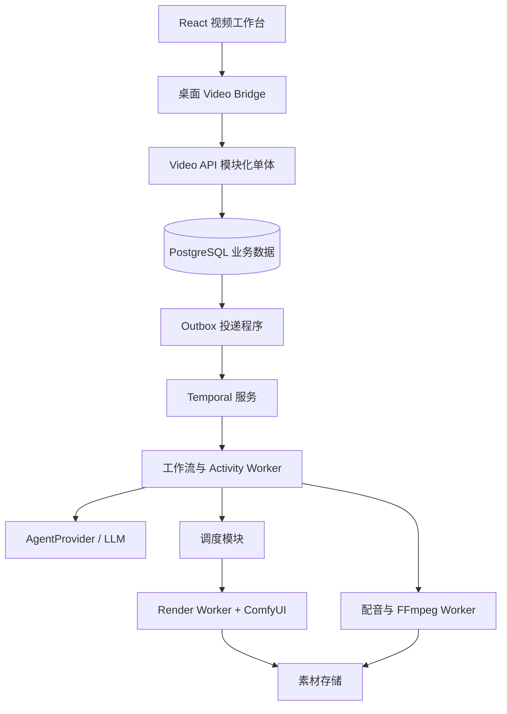

# G01｜工程底座、进程边界与 DSH 集成

> 状态：DRAFT_FOR_REVIEW。交付阶段：B0。前置：G00；身份和运行基线与 G15、G16 共同建立。下游：所有实现目标。

## 1. 目标与边界

建立桌面、业务服务、后台编排、计算执行端的边界。视频任务不依赖用户保持桌面窗口开启；现有 Harness 桌面客户端继续按自己的进程合同管理其本机 Harness。视频功能以新的业务接口接入，不将项目状态塞进 Harness Session。

本次核对的桌面文档为 Electron + React，仓库根声明 Node 24、pnpm 11.13.0。桌面上游基线以现有 `../UI开发/01-技术基线与上游锁定.md` 及仓库 `upstream.lock.json` 为准，不采用 Runtime 课程中另一条旧版本基线。

## 2. 功能清单

| ID | 功能 | 输入与输出 | 交互对象 | 实现要点 |
|---|---|---|---|---|
| G01-F01 | 独立业务服务 | 客户端命令 → 业务 API/快照 | G03、G14 | Node/TypeScript 模块化单体，桌面关闭不负责销毁它 |
| G01-F02 | 后台执行进程 | 任务引用 → 执行结果 | G04、G09、G10、G13 | Temporal Worker、Render Worker、Media Worker 分进程；可运行在同机 |
| G01-F03 | 领域适配边界 | CreativeTaskSpec → 创作结果 | G05 | AgentProvider 接口；Harness 能力隔离在服务端适配器 |
| G01-F04 | 桌面视频通道 | VideoCommand/DTO → 业务服务请求 | G14、G15 | 新 Video Bridge 与现有 Harness Bridge 逻辑隔离，Renderer 不直连服务 |
| G01-F05 | 构建与依赖锁定 | 源码/依赖 → 可验证制品 | G08、G16 | 锁文件、镜像摘要、合同版本和兼容测试组成 Release Manifest |

## 3. 架构与所有权



图中的模块不都需要独立服务。API、Outbox、调度入口和领域服务先共享一个代码库；API、Temporal Worker 与重型媒体执行端使用不同进程。领域服务写入同一个业务数据库，Temporal 服务使用自己的持久化数据库/凭据，禁止业务 SQL 读写 Temporal 内部表。

| 对象 | 唯一责任方 | 其他模块允许做什么 |
|---|---|---|
| 视频 Project/Revision/Approval | Video Domain | UI 通过命令编辑；Agent 提交候选草稿 |
| 制作推进逻辑 | Temporal Workflow | 领域 API 接收启动/暂停/取消意图，工作流按已记录命令推进 |
| RenderJob/Attempt | Render Domain | Worker 按租约提交执行事实；不可自行创建额外候选 |
| Harness Session/工具循环 | 被选用的 Harness Runtime | AgentProvider 通过受支持接口访问，不复制其内部持久化逻辑 |
| ComfyUI 实例/本地输出目录 | Render Worker Supervisor | 业务服务只通过 Worker 协议提交任务 |
| 桌面自带 Harness 生命周期 | 原 Electron Main | 与视频生产服务、服务端 Harness 数据目录完全分开 |

## 4. 技术选择与兼容门禁

| 层 | 本方案选择 | 原因与必须验证项 |
|---|---|---|
| 业务后端 | Node 24 + TypeScript + Fastify | 延续仓库语言，JSON Schema 验证 API；精确版本和 Node 兼容性在 B0 固定 |
| 数据 | PostgreSQL 17 系列，SQL migrations，参数化查询 | 事务、唯一约束和行锁；驱动精确版本及连接池行为由 B0 验证 |
| 编排 | Temporal TypeScript SDK | 长流程、恢复和人工等待；SDK/Server/UI 相互兼容后固定版本 |
| Schema | JSON Schema 2020-12 为数据合同；服务端使用匹配的验证器 | 明确配置方言，生成 TS 类型；Fastify 内置默认方言不能未经配置直接混用 |
| 文件 | StoragePort；开发文件后端、部署 S3 兼容后端 | 用适配器合同测试验证上传、读取、校验、删除；生产产品选型在部署基线中固定 |
| 推理 | ComfyUI 独立 Python 环境 | 每套流程固定模型、自定义节点和环境；与 Node 构建闭包分离 |
| 后期 | FFmpeg/ffprobe 固定制品 | 记录 build flags、字体、编码器和可用滤镜 |
| 桌面 | 延续现有 Electron + React 合同 | 不另起 Vue 前端，不改变现有 Harness 通道含义 |

Fastify 支持 Schema 验证和序列化，Schema 本身只能来自经过审核的应用代码；用户上传的数据不能作为可执行的动态 Schema。[官方验证文档](https://fastify.dev/docs/latest/Reference/Validation-and-Serialization/)

本表作出技术方向选择，不伪造尚未验证的精确补丁版本。B0 必须产出 `video-release.lock.json`，记录所有精确版本/摘要并通过启动及合同测试；未完成不得进入真实模型集成。当前仓库的已有版本不因本设计被自动修改。

## 5. 建议工程结构

```text
apps/video-api/                 HTTP API、Outbox、领域模块装配
apps/video-workflow-worker/     Temporal Workflows/Activities
apps/video-render-worker/       租约、执行日志、ComfyUI 适配与回查
apps/video-media-worker/        配音适配、探测、字幕与 FFmpeg
packages/video-contracts/      Schema、类型、错误、事件
packages/video-domain/         项目、审批、任务、选片等领域服务
packages/video-storage/        数据库仓储、素材存储端口
packages/video-agent-provider/ 结构化 LLM 与 Harness 适配
packages/video-desktop-client/ 桌面视频 DTO、命令与媒体读取客户端
deploy/video/                  部署清单、版本锁、备份恢复脚本
```

`packages/kernel` 的学习实现不作为视频产品强制依赖。Temporal Workflows 不导入数据库/网络实现；通过 Activities 调用领域服务或供应商适配器。

## 6. 与 DSH 的接入方案

先实现 `AgentProvider.generate(spec, operationId)` 和 `query(operationId)`；首版允许直接调用结构化 LLM，Harness 适配器复用同一接口。这样可以先完成视频闭环，再按实测价值启用 Harness 的工具循环。

使用 Harness 执行后台创作时，由视频服务侧的 Agent Host 管理独立 Harness 实例，使用独立 Home、Workspace、凭据和监督进程；不能依赖桌面关闭时会被回收的实例。首版视频任务不得把“选择桌面 Session”当作必要前置。服务端适配器的支持范围需通过锁定上游版本测试，不声称已有远程 Harness 通道。

桌面只连接 Video API；Video API 可以与桌面同机独立托管，也可以部署到受控服务主机。后者是新的 Video Service 连接能力，不是开放远程 Harness URL。服务地址由受控配置提供，不让 Agent 修改；认证和媒体访问按 G15/G14 实现。

## 7. 失败处理与实现任务

先建立启动健康探测、就绪探测、版本协商，再建立停止接单和有界排空。API 暂停不影响已领取任务执行；数据库不可用时不能发布成功结果。Render Worker 的租约和恢复由 G09/G10 接管。

部署首版采用人工启动的独立服务栈和显式停止命令，桌面不是进程所有者。Windows 服务安装与开机自启可后续交付；若尚未安装，就不能宣传为自动开机可用。不存在服务时 UI 展示配置/启动指引。

实现任务：创建上述边界包及导入规则 → 锁定版本 → 用模拟 Agent/Render/Media 实现最小装配 → 验证桌面重启不会终止服务 → 再接真实适配器。不得为图中每个方框立即创建独立微服务。

## 8. 验收条件

- G01-A1：桌面退出后 API、Temporal 与已经接单的 Worker 保持可用；桌面自有 Harness 按旧合同退出。
- G01-A2：桌面与服务端 Harness 使用独立身份和数据目录，不争抢同一个 Home 锁。
- G01-A3：依赖检查拒绝 Renderer 导入 Node/官方 DSH 包，拒绝 Workflow 代码导入数据库驱动。
- G01-A4：在清洁环境用锁定清单重建模拟闭环；制品可追溯到代码和合同版本。
- G01-A5：模拟 AgentProvider 与真实供应商适配器可切换，项目和镜头数据结构不随之变化。

## 9. 供审核的取舍

建议保留 TypeScript 控制层、Temporal 编排与独立计算端。DSH 是可替换的创作执行能力，业务底座不等待 Runtime 复刻课程全部完成。新 Video Bridge 属于桌面增量范围，需要在实施前同步桌面产品/安全/退出文档；本稿已明确扩展内容，不要求为撰写文档额外确认。
