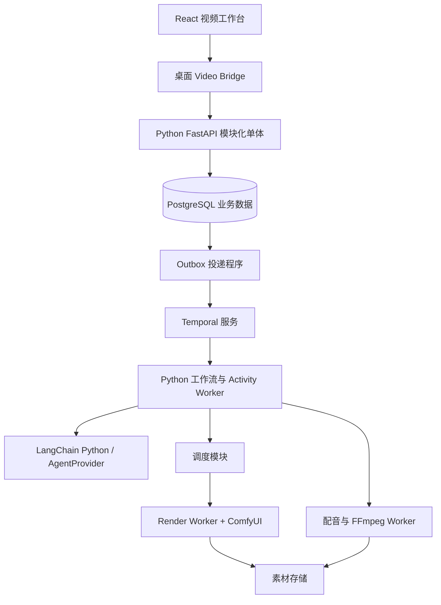

# G01｜工程底座、进程边界与 DSH 集成

> 状态：DRAFT_FOR_REVIEW。交付阶段：B0。前置：G00；身份和运行基线与 G15、G16 共同建立。下游：所有实现目标。

## 1. 目标与边界

建立桌面、业务服务、后台编排、计算执行端的边界。视频任务不依赖用户保持桌面窗口开启；后续接入已有 Harness 桌面客户端时，该客户端继续按自己的进程合同管理其本机 Harness。视频功能以新的业务接口接入，不将项目状态塞进 Harness Session。

2026-09-07 按用户选择采用 Python 后端与 LangChain Python，前端保留 Electron + React / TypeScript。当前仓库没有原稿引用的桌面工程、`UI开发/` 或 `upstream.lock.json`；不将历史 Node/pnpm 声明作为已验证基线。业务 Python 暂以 3.12 为兼容性验证起点，前端工具链和 ComfyUI 环境分别在 B0 锁定。

## 2. 功能清单

| ID | 功能 | 输入与输出 | 交互对象 | 实现要点 |
|---|---|---|---|---|
| G01-F01 | 独立业务服务 | 客户端命令 → 业务 API/快照 | G03、G14 | Python/FastAPI 模块化单体，桌面关闭不负责销毁它 |
| G01-F02 | 后台执行进程 | 任务引用 → 执行结果 | G04、G09、G10、G13 | Temporal Worker、Render Worker、Media Worker 分进程；可运行在同机 |
| G01-F03 | 领域适配边界 | CreativeTaskSpec → 创作结果 | G05 | Python AgentProvider 接口；首版 LangChain，Harness 为可选服务端适配 |
| G01-F04 | 桌面视频通道 | VideoCommand/DTO → 业务服务请求 | G14、G15 | 新 Video Bridge 与现有 Harness Bridge 逻辑隔离，Renderer 不直连服务 |
| G01-F05 | 构建与依赖锁定 | 源码/依赖 → 可验证制品 | G08、G16 | 锁文件、镜像摘要、合同版本和兼容测试组成 Release Manifest |

## 3. 架构与所有权



图中的模块不都需要独立服务。API、Outbox、调度入口和领域服务先共享一个代码库；API、Temporal Worker 与重型媒体执行端使用不同进程。领域服务写入同一个业务数据库，Temporal 服务使用自己的持久化数据库/凭据，禁止业务 SQL 读写 Temporal 内部表。

| 对象 | 唯一责任方 | 其他模块允许做什么 |
|---|---|---|
| 视频 Project/Revision/Approval | Video Domain | UI 通过命令编辑；Agent 提交候选草稿 |
| 制作推进逻辑 | Temporal Workflow | 领域 API 接收启动/暂停/取消意图，工作流按已记录命令推进 |
| RenderJob/Attempt | Render Domain | Worker 按租约提交执行事实；不可自行创建额外候选 |
| 创作任务内部工具循环 | LangChain Python；可选 Harness Runtime | AgentProvider 返回结构化候选，不拥有项目审批或 GPU 派发状态 |
| ComfyUI 实例/本地输出目录 | Render Worker Supervisor | 业务服务只通过 Worker 协议提交任务 |
| 桌面自带 Harness 生命周期（接入时） | 对应 Electron Main | 与视频生产服务、服务端 Harness 数据目录完全分开 |

## 4. 技术选择与兼容门禁

| 层 | 本方案选择 | 原因与必须验证项 |
|---|---|---|
| 业务后端 | Python + FastAPI + Uvicorn | 接入 Python 工具生态；精确版本和依赖兼容性在 B0 固定 |
| Agent | LangChain Python | 结构化创作、受控 Python 工具；按 G05 限制调用次数与成本 |
| 数据 | PostgreSQL 17 + SQLAlchemy 2 + psycopg 3 + Alembic | 事务、唯一约束和行锁；参数化查询，迁移须审查，每个并发任务独立 Session |
| 编排 | Temporal Python SDK（temporalio） | 长流程、恢复和人工等待；SDK/Server/UI 相互兼容后固定版本 |
| Schema | Pydantic v2 模型生成 JSON Schema 2020-12 / OpenAPI | 按 G02 版本化发布；生成前端 TS 客户端并验证跨语言校验一致性 |
| 文件 | StoragePort；开发文件后端、部署 S3 兼容后端 | 用适配器合同测试验证上传、读取、校验、删除；生产产品选型在部署基线中固定 |
| 渲染适配 | Python Render Worker + httpx + websockets + SQLite journal | 异步网络调用、回执落盘和回查；提交不得自动重试 |
| 推理 | ComfyUI 独立 Python / PyTorch 环境 | 每套流程固定模型、自定义节点和环境；与业务 Python 环境分离 |
| 后期 | FFmpeg/ffprobe 固定制品 | 记录 build flags、字体、编码器和可用滤镜 |
| 桌面 | Electron + React / TypeScript | 新建工作台或接入实际提供的桌面工程；保留 Video Bridge 边界 |
| 工程 | 后端 uv / pytest / Ruff；前端 pnpm / Vitest / Playwright | 分别锁定 Python 与前端依赖，按 G17 验证合同和故障恢复 |

FastAPI/Pydantic 的 DTO 只能来自经过审核的应用代码，采用严格字段校验并拒绝未知字段。JSON Schema/OpenAPI 是版本化输出，不能反过来让用户数据创建可执行 Python 模型。前端 TS 类型从发布合同生成，审批、授权和预算仍在领域服务校验。[FastAPI 功能](https://fastapi.tiangolo.com/features/)、[Pydantic JSON Schema](https://docs.pydantic.dev/latest/concepts/json_schema/)

本表作出技术方向选择，不伪造尚未验证的精确补丁版本。B0 必须产出 `video-release.lock.json`，引用后端 `uv.lock`、前端锁文件、ComfyUI 环境锁与制品摘要，并通过启动及合同测试；未完成不得进入真实模型集成。业务服务、模型执行环境和前端依赖分别管理。

## 5. 建议工程结构

```text
frontend/                         React / TypeScript / Electron，pnpm 工程
frontend/src/api/                  生成的客户端与 Video Bridge 适配
backend/pyproject.toml             Python 工程、依赖与各进程入口
backend/uv.lock                    业务 Python 依赖锁
backend/src/video_generation/
  api/                            FastAPI、Outbox、内部 Worker API
  contracts/                      Pydantic 模型、错误与事件
  domain/                         项目、审批、任务、预算与依赖
  storage/                        SQLAlchemy 仓储与 StoragePort
  agents/                         LangChainAgentProvider 与可选适配
  orchestration/                  Temporal Python Workflows / Activities
  render/                         httpx / websockets、journal 与回查
  media/                          配音、探测、字幕与 FFmpeg
backend/migrations/               Alembic 数据库迁移
backend/tests/                    pytest 合同、集成与故障测试
contracts/                        发布的 JSON Schema / OpenAPI 与共同样例
workflows/                        ComfyUI API 图、bindings 与 Bundle
deploy/video/                     部署清单、环境锁、备份恢复脚本
```

这些目录是拟建结构，不表示代码已存在。各 Python 进程从同一模块化后端包装配，按角色使用独立入口；不为每个模块创建微服务。Temporal Workflows 不导入数据库、LangChain 或网络实现，通过 Activities 调用领域服务或供应商适配器；同步重型工具放在专用线程/进程，避免阻塞 asyncio。ComfyUI 内部模块不导入业务服务。

## 6. LangChain 与可选 DSH 接入

先实现异步 `AgentProvider.generate(spec, operation_id)` 和 `query(operation_id)`；首版使用 LangChain Python 的模型接口或有界 `create_agent`，通过 Pydantic 校验返回草稿。LangChain 内部可使用 LangGraph，项目级编排仍由 Temporal 负责。Harness 适配器复用同一接口，只有需要接入时才实现。[LangChain Python 文档](https://docs.langchain.com/oss/python/langchain/overview)

使用 Harness 执行后台创作时，由视频服务侧的 Agent Host 管理独立 Harness 实例，使用独立 Home、Workspace、凭据和监督进程；不能依赖桌面关闭时会被回收的实例。首版视频任务不得把“选择桌面 Session”当作必要前置。服务端适配器的支持范围需通过锁定上游版本测试，不声称已有远程 Harness 通道。

桌面只连接 Video API；Video API 可以与桌面同机独立托管，也可以部署到受控服务主机。后者是新的 Video Service 连接能力，不是开放远程 Harness URL。服务地址由受控配置提供，不让 Agent 修改；认证和媒体访问按 G15/G14 实现。

## 7. 失败处理与实现任务

先建立启动健康探测、就绪探测、版本协商，再建立停止接单和有界排空。API 暂停不影响已领取任务执行；数据库不可用时不能发布成功结果。Render Worker 的租约和恢复由 G09/G10 接管。

部署首版采用人工启动的独立服务栈和显式停止命令，桌面不是进程所有者。Windows 服务安装与开机自启可后续交付；若尚未安装，就不能宣传为自动开机可用。不存在服务时 UI 展示配置/启动指引。

实现任务：创建上述边界包及导入规则 → 锁定版本 → 用模拟 Agent/Render/Media 实现最小装配 → 验证桌面重启不会终止服务 → 再接真实适配器。不得为图中每个方框立即创建独立微服务。

## 8. 验收条件

- G01-A1：桌面退出后 API、Temporal 与已经接单的 Worker 保持可用；接入桌面自有 Harness 时，其按对应合同退出。
- G01-A2：业务 Python 与 ComfyUI 使用独立环境和数据目录；接入桌面与服务端 Harness 时，其使用独立身份和 Home，不争抢锁。
- G01-A3：依赖检查拒绝 Renderer 导入 Node 内置/官方 DSH 包，拒绝 Python Workflow 导入数据库驱动、LangChain 或网络实现；共同样例验证前后端合同一致。
- G01-A4：在清洁环境用锁定清单重建模拟闭环；制品可追溯到代码和合同版本。
- G01-A5：模拟 AgentProvider 与真实供应商适配器可切换，项目和镜头数据结构不随之变化。

## 9. 供审核的取舍

采用 Python 控制层、LangChain Python、Temporal Python SDK 与独立计算端，前端使用 React/TypeScript。DSH 是可替换的创作执行能力，业务底座不等待 Runtime 复刻课程。接入已有桌面工程时，Video Bridge 扩展同步更新对应产品/安全/退出合同；独立桌面交付按 G14 实施。
