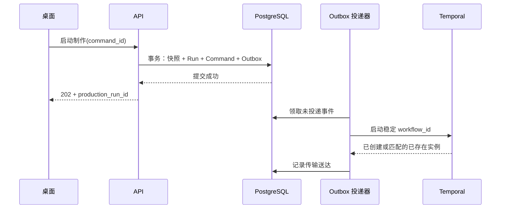

# G03｜项目命令、审批与可靠事件

> 状态：DRAFT_FOR_REVIEW。交付阶段：B1。前置：G01、G02、G15 身份基础。下游：G04–G14。

## 1. 目标与边界

提供所有业务写操作的稳定入口。用户重复点击、网络响应丢失、服务崩溃、审批版本过期时，系统仍能判断操作是否接受、何时生效，以及后续通知是否送达。客户端不得直接给 Temporal 或 ComfyUI 发业务控制请求。

## 2. 功能清单

| ID | 功能 | 输入与输出 | 交互对象 | 实现要点 |
|---|---|---|---|---|
| G03-F01 | 项目与内容命令 | 创建/编辑请求 → ID、新版本 | G02、G05、G14 | 认证、字段校验、并发检查、领域事务 |
| G03-F02 | 命令幂等与结果查询 | command_id → 原结果或冲突 | 所有写入调用方 | 同 ID 同请求返回原记录；同 ID 不同请求拒绝 |
| G03-F03 | 版本绑定审批 | 目标版本/决定 → Approval | G04、G07、G11 | 权限和当前目标校验，审批不跨版本传播 |
| G03-F04 | 冻结与启动制作 | 已审批输入 → 快照、Run、启动事件 | G08、G09、G04 | 同事务写业务记录与 Outbox，启动失败可补发 |
| G03-F05 | 可靠事件投递 | Outbox → 消费/确认记录 | G04、G09、G14 | 至少一次投递、消费去重、失败退避与死信 |
| G03-F06 | 快照与增量查询 | 游标 → Snapshot/EventPage | G14、G16 | 每项目有序事件序号、缺口恢复、分页与脱敏 |

## 3. 对外接口合同

统一前缀 `/video/v1`，HTTP 写操作返回 command_id 和 business_result_ref；耗时命令返回 202 与可查询任务引用，不保持一个 HTTP 连接等待 GPU 完成。

| 接口 | 关键输入 | 关键输出/作用 |
|---|---|---|
| POST /projects | command_id、title、product_profile_ref | project_id |
| POST /projects/:id/revisions | command_id、entity_kind/id、expected_row_version、payload | 新 revision、row_version |
| POST /projects/:id/creative-tasks | command_id、stage、input_refs、provider_profile_ref | creative_task_id |
| POST /projects/:id/approvals | command_id、subject_ref、decision、expected_row_version、comment | approval_id |
| POST /projects/:id/production-runs | command_id、input_refs、render_plan_ref、budget_limit、expected_row_version | snapshot_id、production_run_id |
| POST /production-runs/:id/commands | command_id、action: pause/resume/cancel | 命令接受结果；执行状态异步更新 |
| POST /projects/:id/change-previews | 基础快照、拟修改内容 | G12 impact_plan_id、成本预估；无生成副作用 |
| POST /projects/:id/change-commits | command_id、impact_plan_id、expected_row_version | 新版本/新 Run；计划过期则拒绝 |
| GET /commands/:id | 认证上下文 | ACCEPTED/APPLIED/REJECTED 和结果引用 |
| GET /projects/:id/snapshot | 可选已知版本 | 项目视图、event_cursor |
| GET /projects/:id/events?after=... | 项目游标、limit | 连续事件页，或 SNAPSHOT_REQUIRED |

同类选片、素材确认和导出命令由 G06/G11/G13 定义，全部经过同一个 CommandHandler 基础设施。

## 4. 命令事务实现

`commands` 唯一键为 `(tenant_id, actor_id, command_id)`，另存 canonical_request_digest、action、status、result_ref、created_at。request_digest 包含请求对象及输入版本，不包含传输时间戳。

处理顺序：认证和基础 Schema 校验 → 查/插命令身份 → 同 ID 不同摘要返回 IDEMPOTENCY_CONFLICT → 锁定相关聚合并校验版本/权限 → 执行业务变更 → 保存命令结果与业务事件、Outbox → 事务提交 → 返回。

并发重复命令通过唯一约束和事务协调；读取方只能看到已提交结果。数据库事务提交后响应丢失，客户端使用原 command_id 查询或重发。返回的“已接受”不等于外部任务已执行完毕。

命令幂等记录首版保留至项目删除且相关任务/审计保留期结束；不以短期缓存过期后允许旧命令重新执行。无效 Schema 在进入事务前拒绝；业务拒绝结果可记 REJECTED，修改请求后必须使用新 command_id。

## 5. 审批与并发

Approval 必须绑定具体 `subject_ref + digest + policy_version`。新分镜、参考图、时间线和候选选择不会自动继承旧批准。用户查看旧版本并批准时，若接口语义要求批准当前版本而当前头已变化，则返回 STALE_REVIEW。

已启动制作使用冻结输入。撤销审批阻止依赖该批准的新启动；若用户要停止已经启动的制作，必须另发 cancel 命令，并在 UI 清楚呈现两个结果。不能因为撤销数据库字段，就声称 GPU 已停止。

制作冻结事务校验全部引用 READY、所需审批有效、RenderPlan 与输入摘要一致。先创建 Run 和 Outbox；预算实际预留在 G09 准入时执行，预留失败时 Run 不派发计算任务。

## 6. Outbox / Inbox 与交互顺序

Outbox 领取使用短事务和租约；网络调用在事务外。崩溃发生在发送成功、标记完成之前时允许重发。启动去重使用稳定 workflow_id；已存在但绑定的快照不同则报冲突，不当成成功。

补启动前同时检查业务 Run 是否仍需启动；已完成/已取消 Run 的旧事件只补记处理结果，不能因为 Temporal 历史已过保留期就重新创建并执行。业务幂等记录的保留期独立于编排历史。

投递给活动 Workflow 的业务命令带 event_id、project_event_seq 和 subject_ref。信号被 Temporal 接收只算“传输送达”；工作流调用领域服务完成操作后，另记消费结果。业务消费表以 `(consumer, event_id)` 唯一，并与该消费者的业务写入同事务提交。

每项目事件序号在锁定 project_event_counter 的事务中递增，避免用可乱序提交的全局自增 ID 假装项目业务顺序。并行命令可按聚合 row_version 校验；依赖顺序缺失时等待补齐/加载快照，不盲目执行后一条。

初始重试策略为指数退避，最多间隔 60 秒；24 小时未送达进入运维可见死信，但不删除消息。事件格式为 event_id、schema_version、tenant/project、seq、type、subject_ref、occurred_at、causation_command_id、trace_id、payload。载荷不含视频二进制和秘密。

## 7. 错误、恢复与实现任务

主要错误：VALIDATION_FAILED、FORBIDDEN、VERSION_CONFLICT、STALE_REVIEW、IDEMPOTENCY_CONFLICT、DEPENDENCY_NOT_READY、SERVICE_UNAVAILABLE。错误含字段路径、可否重试及当前版本；不泄露跨租户对象存在性。

UI 断线按 snapshot.event_cursor 恢复。事件保留期首版默认 30 天，旧游标返回 SNAPSHOT_REQUIRED；业务对象和命令记录不随增量事件清理删除。重要业务事件持久化，高频进度仅做可丢弃遥测，不能每帧写一条业务事件。

Snapshot 的业务数据和 event_cursor 在同一一致性读取事务中取得；不能先取旧项目数据、再取新游标，导致客户端永久跳过中间变更。首版事件通道可通过 Bridge 按游标拉取，前台默认间隔 1 秒、后台 5 秒，失败指数退避；后续改为推送时保留同一游标与缺口恢复合同。

实现任务：基础 CommandHandler → 版本仓储接入 → 项目/审批命令 → Outbox 投递器 → Workflow 启动与消费确认 → Snapshot/Event API → 并发和崩溃注入测试。

## 8. 验收条件

- G03-A1：同一启动命令并发提交 20 次，只存在一个 Run、一份快照及一个逻辑启动事件；不同请求共用 ID 返回冲突。
- G03-A2：数据库提交后立即终止 API，重启查询仍能返回原命令结果，Outbox 最终启动正确工作流。
- G03-A3：发送成功后终止投递器，恢复重发不创建第二个 Run/Workflow；消费记录不重复。
- G03-A4：批准 v3 后编辑 v4，启动 v4 被拒绝，旧 v3 的批准记录仍可查询。
- G03-A5：两个项目同时写事件，各自游标连续；断线超过保留期后以快照恢复，不漏掉当前任务状态。
- G03-A6：通知到达但业务消费失败时，界面仍显示待处理/错误，不把送达当成任务完成。

## 9. 供审核的取舍

首版采用数据库 Outbox，不另加 Kafka。所有按钮对应明确命令；确认页面显示被审批版本和预计影响。冲突时要求重新核对目标，不静默自动合并审批或覆盖草稿。
